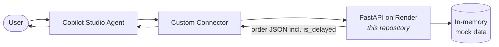

# Order Status API

> A small **FastAPI** service that powers a **Microsoft Copilot Studio** conversational agent for order‑status questions. The agent asks for an order number, calls this API, explains the result in plain language, and offers to open a support ticket when an order is delayed.


This repository contains the **API only**. It is the backend that a Copilot Studio agent calls through a custom connector. The conversational logic lives in Copilot Studio; everything here is the data service behind it.

---

## Live demo

- **Interactive API docs (Swagger UI):** https://order-status-api-1s8s.onrender.com/docs
- **Health check:** https://order-status-api-1s8s.onrender.com/health

> Hosted on Render's free tier, so the first request after a period of inactivity may take a few seconds to wake the service.

---

## What it does

The agent's job is to answer "where's my order?" without a human in the loop, and to escalate when something is actually wrong. This API supports that by returning a clean JSON view of an order, plus a single decision the agent can act on: **is this order delayed?**

The delay decision is intentionally **computed on the server**, not in the agent — see [Key design decision](#key-design-decision) below.

---

## Architecture



The agent captures the order number, the custom connector calls `GET /orders/{order_number}`, and the API returns the order details together with a server‑computed `is_delayed` flag. The agent uses that flag to decide whether to offer a support ticket.

---

## Key design decision

**`is_delayed` is calculated in the API, not in the agent.**

The rule is:

> An order is **delayed** when its estimated shipping date is in the past **and** it has not yet been fulfilled (i.e. its status is not *Shipped*, *In Transit*, *Delivered*, or *Cancelled*).

Computing this server‑side keeps a **single source of truth**, makes the rule **unit‑testable**, and removes all date/time‑zone arithmetic from the agent's side. It also handles the non‑obvious edge case correctly: an order whose shipping date has passed but which was already **Delivered** is *not* flagged as delayed.

---

## API reference

| Method | Path | Description |
| --- | --- | --- |
| `GET` / `HEAD` | `/` and `/health` | Health check. Also used to warm the free‑tier host before a demo. |
| `GET` | `/orders` | List all seeded orders. |
| `GET` | `/orders/{order_number}` | Return a single order, or `404` if it doesn't exist. |

Lookups are forgiving — `ORD-1002`, `ord-1002`, and `1002` all resolve to the same order.

**Example** — `GET /orders/ORD-1002`:

```json
{
  "order_number": "ORD-1002",
  "order_status": "Processing",
  "order_date": "2026-06-09",
  "total_value": 1299.0,
  "currency": "PLN",
  "payment_status": "Paid",
  "estimated_shipping_date": "2026-06-18",
  "is_delayed": true
}
```

> Dates are generated **relative to the current date**, so the sample scenarios stay correct whenever the API is run.

An optional API‑key gate is built in: set an `API_KEY` environment variable and callers must then send it as an `X-API-Key` header. It is **off by default** so the demo works without configuration.

---

## Sample data

Four orders are seeded in memory, each chosen to exercise a different path:

| Order | Status | Payment | Est. shipping | `is_delayed` | Demonstrates |
| --- | --- | --- | --- | --- | --- |
| `ORD-1001` | In Transit | Paid | future | `false` | Happy path — on its way, on time |
| `ORD-1002` | Processing | Paid | **past** | **`true`** | **Delayed → triggers escalation** |
| `ORD-1003` | Delivered | Paid | past | `false` | Edge case — past date, but already delivered |
| `ORD-1004` | Processing | Pending | future | `false` | Pending payment, still on time |

---

## Run locally

Requires **Python 3.12**.

```bash
# install dependencies
pip install -r requirements.txt

# run the API with auto-reload
uvicorn main:app --reload

# open the interactive docs
# → http://127.0.0.1:8000/docs
```

## Tests

```bash
pip install -r requirements-dev.txt
pytest
```

The test suite covers the `is_delayed` rule across every seeded scenario — including the delivered‑but‑past‑date edge case — plus the forgiving lookup and the `404` path.

---

## Deployment

Deployed on **Render** as a web service:

- **Build command:** `pip install -r requirements.txt`
- **Start command:** `uvicorn main:app --host 0.0.0.0 --port $PORT`
- **Environment:** `PYTHON_VERSION=3.12.2`

Because the free tier sleeps when idle, an external uptime ping keeps it warm. The health endpoints answer both `GET` and `HEAD` so a `HEAD`‑based monitor wakes the service correctly.

---

## Copilot Studio integration

The agent connects to this API through a **custom connector** generated from [`connector-swagger.json`](connector-swagger.json) (Swagger 2.0, the format Power Platform imports). The connector exposes the `GetOrder`, `ListOrders`, and `HealthCheck` operations.

On the agent side (built in Copilot Studio):

- **Classic, deterministic topic orchestration** for predictable behaviour.
- The order number is **validated** before the API is called, so malformed input is handled gracefully without a wasted request.
- **Escalation is modelled as a variable** (`TicketCreated`) that is set when the user accepts a ticket on a delayed order.
- A **fallback** and an **on‑error** path keep off‑topic or failed requests friendly instead of dead‑ending.
- Responses are validated with a **GenAI evaluation** (a golden set scored on general quality plus a custom grader that encodes the escalation rule).

---

## Engineering practices

- **Single source of truth** — business logic (`is_delayed`) lives in one place and is unit‑tested.
- **Typed API contract** — an OpenAPI/Swagger definition drives the connector instead of hand‑wired HTTP.
- **Automated tests** — `pytest` suite covering the core rule and edge cases.
- **GenAI evaluation** — the agent's responses are scored against a golden set with a custom correctness grader.
- **Graceful failure** — clear `404`s, optional auth, permissive CORS, and a friendly agent‑side error path.
- **Reproducible deploy** — pinned Python version, declared dependencies, and a `Procfile`.

---

## Tech stack

**Python 3.12** · **FastAPI** · **Pydantic** · **Uvicorn** · **pytest** · **Render** · **Microsoft Copilot Studio** (custom connector)

---

## Project structure

```
.
├── main.py                 # FastAPI app: endpoints, order model, is_delayed rule, seed data
├── test_main.py            # pytest suite (rule, edge cases, lookup, 404)
├── connector-swagger.json  # Swagger 2.0 definition for the Power Platform custom connector
├── requirements.txt        # runtime dependencies
├── requirements-dev.txt    # dev/test dependencies
├── Procfile                # start command for deployment
└── README.md
```

---

## Possible next steps

This is a focused demo, not a production system. To take it further:

- Back the API with a **real order database** instead of in‑memory mock data.
- Add **authentication** on the connector (API key or OAuth) with managed secrets.
- Create tickets in a **real ITSM system** (e.g. via Power Automate) and return a ticket reference.
- Add **observability** (structured logs, telemetry) and run the agent evaluation in **CI**.
